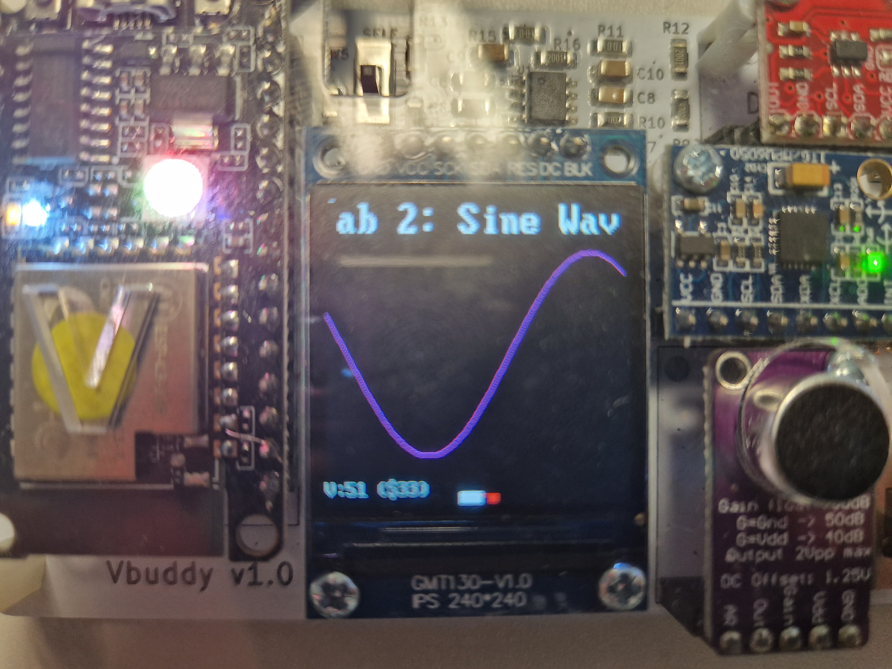
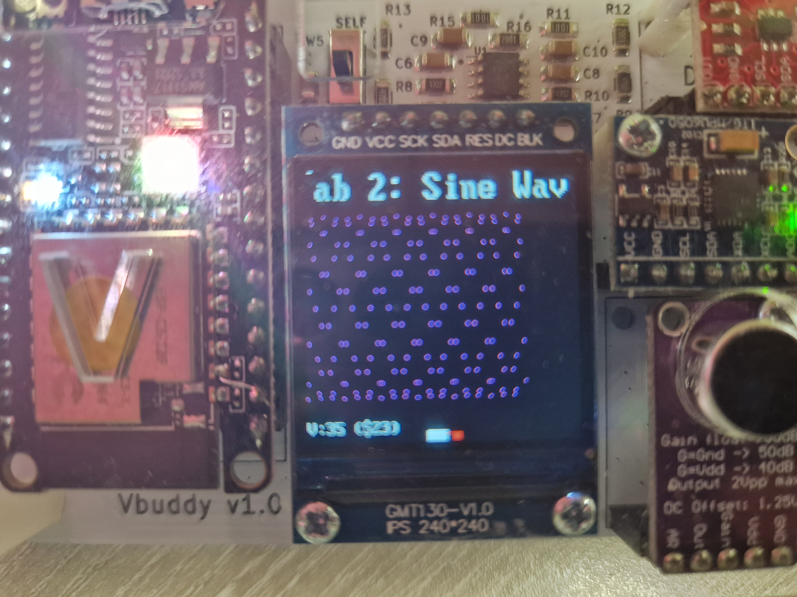

# Lab 2: Signal Generation and Capture

## Task 1: Simple Sinewave Generator

### Overview
1. Create a 256 * 8 bit rom.sv module with sinewave datapoints as its memory content.
2. Create a sinegen.sv module which links the counter and rom together.
3. Create a cpp testbench code to simulate the sinegen module on Vbduddy.
4. Modify design to use Vbuddy knob to alter the frequency of the generated wave.

### Deeper Review
Initially, we are provided with the sinegen.py file which uses a simple for loop to generate 256 sinewave datapoints and writes it into sinerom.mem to be read from by the system verilog rom file. rom.sv is created by intialising the size of the the amount of memory and number of bits per memory address. It was interesting to learn how simple the syntax was for setting this up. Then, the SV code uses pseudo commands display UI when the rom has been created and then loads the datapoints from sinerom.mem into rom_array. Finally output of this module at each clock positive edge is the data stored within each address.

However, this address can't increment on its own hence a counter is needed to do this at each clock cycle. These two modules are linked together using singen.sv which simply acts as a communication point between the two modules. As shown below, each internal signal in counter is connected through to rom with one exception of using an extrenal signal "address" because rom.sv has no such signal name count.

Now. to actually simulate the sinwave on Vbduddy, we need to create a testbench file called sinegen_tb.cpp. Here are the lines we needed to change or add from standard code:
- *Line 1:* Including Vsinegen.h module so it can be used.
- *Line 12:* Assigning top to be Vsinegen and not some other function.
- *Line 17:* Storing the recorded data in a file named sinegen.vcd.
- *Line 28:* Initialising incr = 1 which determines in what jumps the counter increments through the rom_array.
- *Line 31:* Increased the for loop count to go to a much higher number so the simulation doesn't end so quickly.
- *Line 33-37:* **[CHALLENGE]** The purpose of the code here was to use vbdValue() function, which is the knob on the Vbuddy, to change the frequency of the sine wave generated. This is where we thought to change vbdValue() = incr and likewise in the count module for count = count + incr which allows us to change the jumps between datapoints hence the frequency. However, this resulted in the frequency change happening too rapidly that the plot would look very spaced out and mupltiple sine waves dotted around. Hence, we implemented an if statement to update the value of incr every 50 cycles so that change was gradual and not sudden. As a result, the curve looked much smoother and was very satisfying!
- *Line 47-48:* Uses an if statement to reminate the simulation if either the program has finished or if the key is pressed which is equal to the ASCII value of "q".

### **Standard Sine Wave Generated**

### **CHALLENGE: Sine Wave with Rapid Frequency Change**

### **CHALLENGE: Sine Wave with Gradual Frequency Change**

## Task 2: Sine and Cosine Dual Wave Generation

For this task, I got rid of the incr signals everywhere because I assumed the task meant that frequency is kept constant. Therefore, I added a new signal logic called offset which will add on the extra jump on the address of second sine wave. This is done in sinegen.sv by creating another internal logic called address2 = address1 + offset which is fed into the rom to allow the next rom memory value of dout2 to be incremented accordingly and hence going out of phase.